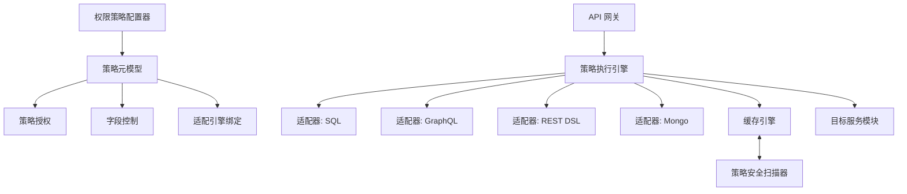
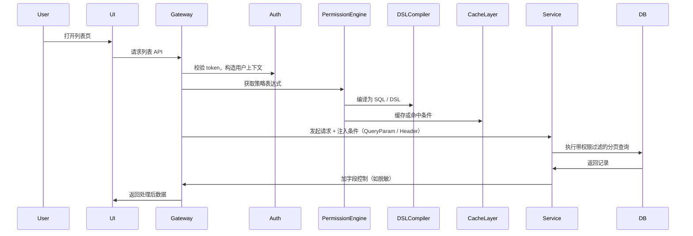
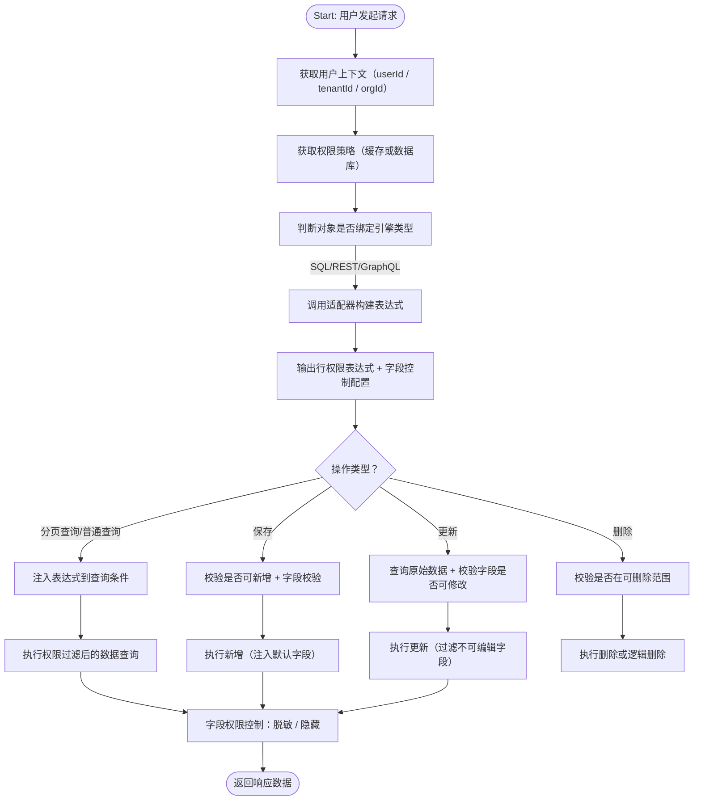

非常好，以下是**面向SaaS多租户系统的PaaS数据权限管理模块 PRD（科学架构 + 可持续性 + 算法闭环版）**，强调：

* ✅ 高并发大数据可持续性
* ✅ 前后置依赖建模与隔离保障
* ✅ 简洁科学的表达式模型与执行算法
* ✅ 微服务+网关+引擎适配+缓存+调试器完整闭环

---

# ✅ 数据权限管理模块 PRD

**版本：v2.0**｜**适用架构：SaaS 多租户 + 微服务 + PaaS 引擎**

---

## 一、产品定位

该模块为SaaS平台提供统一的“数据访问安全控制框架”，在多租户、多组织、多引擎、多维度的复杂业务场景下：

* 实现灵活可配置的**行权限（数据行过滤）**与**列权限（字段可见/可编辑/脱敏）**
* 支持面向 SQL、REST、GraphQL、NoSQL 的权限适配执行
* 提供缓存、调试、策略分发与网关联动能力
* 面向未来支持规则引擎、数据湖、大模型接入等演进

---

## 二、系统架构图



---

## 三、适用场景与价值

| 场景      | 权限控制点           | 支持模式       |
| ------- | --------------- | ---------- |
| 销售订单列表  | 用户仅能查看本组织数据     | 行权限：组织过滤   |
| 采购合同页面  | 金额字段只读          | 列权限：字段控制   |
| 数据API接口 | 动态注入QueryParam  | REST适配器    |
| 报表分析页面  | 动态注入 GraphQL 条件 | GraphQL适配器 |

---

## 四、核心功能模块与建模结构

### 4.1 权限策略建模

| 元对象                               | 描述                    |
| --------------------------------- | --------------------- |
| meta\_permission\_policy          | 策略主表，定义条件DSL、字段权限、状态等 |
| meta\_permission\_grant           | 授权绑定表：策略绑定到角色/用户/组织   |
| meta\_permission\_field           | 字段级别控制配置              |
| meta\_permission\_engine          | 支持的执行引擎类型             |
| meta\_permission\_object\_binding | 单据对象绑定引擎执行方式          |
| meta\_permission\_cache           | 策略缓存管理表（可选持久化）        |

---

## 五、功能说明与逻辑说明

### 5.1 策略配置器

| 功能      | 说明                  |
| ------- | ------------------- |
| 行权限条件构建 | 基于维度建模拖拽 + DSL表达    |
| 字段权限控制器 | 控制字段是否展示、是否可编辑、是否脱敏 |
| 授权管理    | 绑定角色、组织、用户          |
| 引擎绑定    | 每个策略可绑定目标引擎（按对象）    |

> DSL表达设计采用`逻辑树结构 + 变量占位符`，支持递归优化编译

示例DSL：

```json
{
  "AND": [
    { "field": "org_id", "operator": "IN", "value": "${current_user_orgs}" },
    { "field": "salesman_id", "operator": "=", "value": "${current_user_id}" }
  ]
}
```

---

### 5.2 引擎适配与执行

| 引擎      | 执行方式                    |
| ------- | ----------------------- |
| SQL     | WHERE子句拼接               |
| REST    | QueryParam 或 Header 注入  |
| GraphQL | variables 或 query嵌套字段构造 |
| NoSQL   | JSON filter（如 Mongo）    |

> 引擎统一实现接口 `PermissionAdapter`，注册于 `meta_permission_engine`，支持热插拔

---

### 5.3 网关策略注入封装

| 功能            | 说明                           |
| ------------- | ---------------------------- |
| 请求拦截器（Filter） | 拦截请求，识别租户、用户                 |
| 调用权限引擎        | 获取策略条件与字段控制配置                |
| 注入执行层         | 注入 Header / Query / Variable |
| 多服务联动支持       | 跨服务传递权限控制字段                  |

---

### 5.4 权限调试器

| 功能         | 说明                  |
| ---------- | ------------------- |
| 模拟用户访问策略   | 输入用户+模块，模拟条件与字段控制效果 |
| 检查策略冲突     | 同字段策略矛盾提示           |
| 校验策略覆盖     | 所有字段是否都被策略覆盖        |
| 输出注入表达与SQL | 显示执行表达式与最终结构体       |

---

### 5.5 权限缓存机制（高并发保障）

| 类型    | 技术       | 说明                     |
| ----- | -------- | ---------------------- |
| 分布式缓存 | Redis    | 跨服务共享权限结果，5\~15min TTL |
| 更新机制  | 主动/定时    | 策略变更后刷新缓存 + 异步广播更新通道   |

> 防击穿策略：空策略缓存标识 + 双层缓存结构

---

## 六、逻辑闭环保障机制（前后置约束）

| 关联依赖           | 逻辑约束说明           |
| -------------- | ---------------- |
| 策略必须绑定执行引擎     | 否则视为未生效策略，调试器可报警 |
| 字段必须存在于目标数据模型中 | 配置器加载元字段校验       |
| 策略不能命中为空       | 提供策略“空匹配”预警机制    |
| 用户角色组合策略解析必须唯一 | 优先级 + 冲突检测机制处理   |

---

## 七、算法设计与执行策略（简洁 + 可持续）

### 7.1 权限表达式生成算法（伪代码）

```python
def build_permission_expression(policy, user_context):
    parsed = parse_dsl(policy.condition_json)
    resolved = resolve_variables(parsed, user_context)
    return generate_sql_or_json(resolved)
```

### 7.2 策略合并规则（用户多角色）

1. 策略按优先级升序排列
2. 字段权限合并（隐藏优先 > 可见 > 可编辑）
3. 行权限合并（默认 AND 叠加 / 可配置为 OR）
4. 冲突时以字段“最严”原则为主

---

## 八、大数据适配与可持续性优化

| 问题        | 设计方案                          |
| --------- | ----------------------------- |
| 百万级数据分页查询 | 权限条件注入走索引字段（org\_id、user\_id） |
| 高并发用户访问策略 | 策略缓存、预编译表达式、Lazy加载            |
| 多租户隔离     | 数据表加租户字段 / 权限条件自动注入           |
| 扩展适配器     | SPI热插拔，避免强耦合                  |

---

## 九、安全扫描与诊断机制

| 检查项            | 提示策略        |
| -------------- | ----------- |
| 策略未绑定任何授权对象    | 标记为“孤儿策略”   |
| 字段权限未覆盖        | 提示潜在数据泄漏风险  |
| 冲突策略检测         | 自动列出冲突字段与角色 |
| 空策略检测（WHERE永假） | 标红提示 + 自动禁用 |

---

## 十、交互建议（页面设计）

* 策略管理页（策略列表 + 创建策略）
* 策略编辑页（DSL构建器 + 字段控制表格 + 引擎绑定 + 调试预览）
* 引擎注册页（展示支持引擎 + 适配器类名 + 可启停）
* 单据绑定页（对象 → 引擎配置）
* 权限模拟页（用户+模块 → 策略预览+字段控制）

---

以下是**数据权限管理模块**四大关键子系统的**落地辅助 PRD 说明**，确保具备工程可实施性、组件解耦能力、性能稳定性，并预留未来演进能力：

---

# ✅ 辅助 PRD：表达式引擎 + 页面配置器 + 网关注入 + Redis 缓存层

---

## 一、策略表达式引擎（Policy DSL Expression Engine）

### 1.1 模块目标

将策略中配置的权限条件（行权限 DSL）从结构化 DSL 表达式编译为目标引擎可执行表达式（SQL、REST、GraphQL、Mongo JSON），具备：

* ✅ 可维护、可解释的结构表示（AST）
* ✅ 可执行编译器（ExpressionCompiler）
* ✅ 可调试、可复用的表达式结果

### 1.2 支持表达式结构

```json
{
  "AND": [
    { "field": "org_id", "operator": "IN", "value": "${current_user_orgs}" },
    { "field": "owner_id", "operator": "=", "value": "${current_user_id}" }
  ]
}
```

> 支持 AND / OR / NOT、括号嵌套、变量占位符 `${}`、多值集合、常量

---

### 1.3 PRD逻辑结构

| 子模块               | 说明                |
| ----------------- | ----------------- |
| DSL Parser        | JSON → AST 解析器    |
| Variable Resolver | 根据上下文解析 `${变量}`   |
| SQLCompiler       | 生成 SQL 片段         |
| GraphQLCompiler   | 生成 GraphQL 条件树    |
| RestParamBuilder  | 转换为 QueryParam 对象 |
| MongoCompiler     | 转换为 Mongo JSON 条件 |

---

### 1.4 性能与可持续性优化

* ✅ 表达式缓存（AST结构 / 编译结果）
* ✅ 表达式模板复用（策略结构不变仅变量变）
* ✅ 表达式测试与快照版本调试

---

## 二、策略页面配置器原型（Vue3 原型）

### 2.1 模块目标

构建支持“策略可视化配置”的界面，融合 DSL 构建器、字段控制器、授权器、引擎绑定器、调试器。

### 2.2 页面结构设计

```
<PermissionPolicyEditor.vue>
├── Tab1: 策略基本信息表单
├── Tab2: 行权限条件配置器（拖拽 + 表达式 + DSL编辑器）
├── Tab3: 字段权限控制器（字段表格）
├── Tab4: 策略授权（角色/组织/用户绑定器）
├── Tab5: 引擎适配绑定器（关联单据、页面）
├── Tab6: 权限模拟调试器（输入用户 + 页面 → 权限结果）
```

### 2.3 技术实现建议

* Vue3 + Element Plus + JSONEditor + X6 画布（表达式图形）
* 所有字段来源绑定 `meta_column`
* 条件生成器支持“结构 + DSL同步编辑模式”

---

## 三、网关注入组件（基于 Spring Cloud Gateway）

### 3.1 模块目标

在 API 网关层面统一完成：

* ✅ 用户身份识别（JWT / Header）
* ✅ 策略调用并获取表达式（基于 objectCode + routeId）
* ✅ 注入权限条件（QueryParam / Header / GraphQL 变量）

---

### 3.2 网关Filter封装接口

```java
@Component
public class PermissionInjectionGatewayFilter implements GlobalFilter {

    @Autowired
    private PermissionEngineClient engine;

    @Override
    public Mono<Void> filter(ServerWebExchange exchange, GatewayFilterChain chain) {
        // 1. 解析 token 与 userContext
        // 2. 判断当前 route 是否绑定策略
        // 3. 获取策略执行表达式（SQL / GraphQL / Param）
        // 4. 注入到 Request 中
    }
}
```

---

### 3.3 支持注入模式

| 类型       | 示例注入                        |
| -------- | --------------------------- |
| REST     | `?org_id=xxx&user_id=xxx`   |
| Header   | `X-Policy-Org: ORG001`      |
| GraphQL  | `variables: { orgId: xxx }` |
| Body嵌套字段 | 修改 JSON 结构添加权限嵌套字段          |

---

## 四、策略缓存层落地（Redis + Caffeine）

### 4.1 模块目标

* 缓解频繁策略解析调用压力
* 防止 DB 热点击穿
* 支持热加载、同步失效、版本控制

---

### 4.2 缓存结构设计

```java
class PermissionCacheKey {
    String tenantId;
    String userId;
    String objectCode;
    String pageCode;
}

class PermissionCacheValue {
    String rowCondition; // 如 SQL/JSON 条件
    Map<String, FieldPermission> fieldMap;
    Long expireAt;
}
```

---

### 4.3 双层缓存机制

| 缓存级别 | 技术栈      | 说明                  |
| ---- | -------- | ------------------- |
| 本地缓存 | Caffeine | 热数据快速命中（1分钟）        |
| 分布缓存 | Redis    | 所有服务共享，5\~15min TTL |

---

### 4.4 缓存更新机制

* 策略变更 → 主动广播 `cache:invalidate:key`
* 定时刷新 → 后台异步刷新到期策略
* 灰度策略 → 支持版本号缓存并按用户切换策略快照

---

## ✅ 统一建议

| 目标   | 建议                               |
| ---- | -------------------------------- |
| 性能保障 | 所有策略执行链支持缓存（表达式缓存 + 结果缓存）        |
| 调试保障 | 所有注入参数支持日志打印与调试器回溯               |
| 安全保障 | 所有注入参数应加签或校验，防止伪造                |
| 可维护性 | 所有策略/字段控制支持 UI 可视配置 + JSON 编辑双模式 |

---
好的，以下是面向\*\*数据权限管理模块中所有基础操作（分页查询、普通查询、保存、删除、更新）\*\*的完整 PRD 逻辑设计，确保各操作具备：

* ✅ 权限校验闭环（行权限+列权限）
* ✅ 缓存与适配器联动（表达式注入）
* ✅ 微服务与平台架构适配（REST/GraphQL/NoSQL兼容）
* ✅ 大数据量下的稳定性与可持续执行能力

---

# ✅ 数据权限五大基础操作 PRD 逻辑说明（分页查询 / 查询 / 保存 / 删除 / 更新）

---

## 一、分页查询逻辑（list with pagination）

### 1. 功能说明

用户访问带分页列表页时，系统需对数据进行**基于策略的行级过滤**和**字段级展示控制**，最终返回：

* 具备权限范围内的数据行
* 字段权限处理后的数据结构（字段脱敏 / 隐藏）
* 可分页的性能保障（索引字段 + 条件表达式优化）

---

### 2. 处理流程



---

### 3. 权限逻辑细节

| 维度    | 行权限注入            | 列权限注入              |
| ----- | ---------------- | ------------------ |
| 角色    | role\_id → 权限表达式 | role\_id → 字段可见性控制 |
| 用户    | user\_id 优先生效策略  | 同上                 |
| 多策略合并 | 按优先级合并           | 字段权限“最严”合并（不可见优先）  |

---

### 4. 性能保障设计

* ✅ 所有权限表达式字段必须走索引（如 org\_id、created\_by）
* ✅ 支持分页游标方式或最大页限制
* ✅ 表达式层缓存（AST + 结果）

---

## 二、普通查询（详情、非分页列表）

### 1. 功能说明

用于查询某一特定记录（详情页）、或不分页的列表（如导出、下拉框等）；

系统需确保仅查询**在权限范围内的记录**，并控制字段级的可见性。

---

### 2. 核心逻辑说明

* 自动注入 WHERE 限制条件（如：id=xxx AND org\_id in 用户组织）
* 字段控制：脱敏、隐藏（返回前端前处理）

---

### 3. 可嵌入策略

| 场景       | 特殊控制             |
| -------- | ---------------- |
| 下拉框数据加载  | 自动加组织或所属人过滤      |
| 详情页跳转    | 校验是否能访问该 ID      |
| 异步数据拉取接口 | 注入静态字段配置（默认字段只读） |

---

## 三、保存逻辑（create）

### 1. 功能说明

系统保存（新增）数据时，需要：

* 校验用户是否有权限创建（组织、角色、客户范围等）
* 控制字段是否可编辑（如：金额字段只能由财务填写）
* 注入默认字段值（如：创建人、组织ID）

---

### 2. 权限控制逻辑

| 类型   | 控制点                                         |
| ---- | ------------------------------------------- |
| 组织权限 | 判断目标组织是否在用户可维护范围内                           |
| 字段权限 | 检查是否可填写（字段权限配置为 editable）                   |
| 默认注入 | 自动写入 current\_user\_id、current\_org\_id 等字段 |

---

### 3. 拦截与校验建议

* 后端 Service 层使用 `@PermissionValidate` 注解
* 调用 PermissionEngine 检查目标字段 + 校验 DSL 条件
* 禁止直接写入越权字段（如金额、审批状态等）

---

## 四、更新逻辑（update）

### 1. 功能说明

修改数据时系统需：

* 校验该数据是否在用户可编辑范围（行权限）
* 校验字段是否可编辑（列权限）
* 禁止编辑只读字段或越权字段（如状态字段）

---

### 2. 逻辑流程

```text
1. 获取用户权限策略（含条件表达式与字段配置）
2. 查询目标数据是否在权限范围
3. 判断提交字段是否为“只读字段”
4. 拒绝修改不可编辑字段（系统抛错）
5. 写入更新 + 更新字段标识
```

---

### 3. 特殊建议

* 所有字段必须走字段配置权限检查表
* 对比原始值与新值，仅处理有权限字段
* 保留修改日志（字段级操作审计）

---

## 五、删除逻辑（delete）

### 1. 功能说明

系统需限制数据的删除范围：

* 仅允许删除用户有“可操作权限”的记录
* 不可越权删除（如跨组织、跨业务线）
* 删除权限可配置为字段 + 角色维度组合策略

---

### 2. 删除前检查流程

```text
1. 判断是否有删除策略（策略中标识 delete = true）
2. 判断目标数据是否属于行权限可操作范围
3. 检查用户是否满足“可删除字段条件”（如状态字段必须为草稿）
```

---

### 3. 删除行为处理建议

| 删除方式 | 控制策略                       |
| ---- | -------------------------- |
| 物理删除 | 高敏感数据禁止                    |
| 逻辑删除 | 更新 `is_deleted = 1`，保留修改记录 |
| 批量删除 | 限制条件表达式后再执行                |

---

## 六、统一建议与最佳实践

| 控制点     | 建议                   |
| ------- | -------------------- |
| 所有查询    | 自动注入权限表达式            |
| 所有修改与新增 | 字段权限先校验，再处理          |
| 权限策略    | 支持“最小授权原则”：不赋予可疑字段权限 |
| 表达式执行   | 支持缓存、调试、版本快照回滚       |
| 日志审计    | 所有权限决策过程记录至日志与审计表    |

---

## 控制流程图


